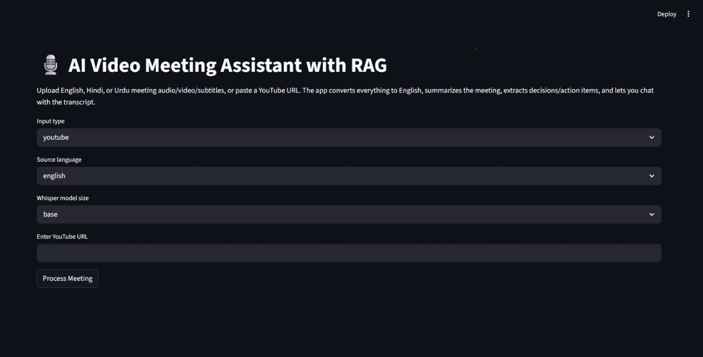
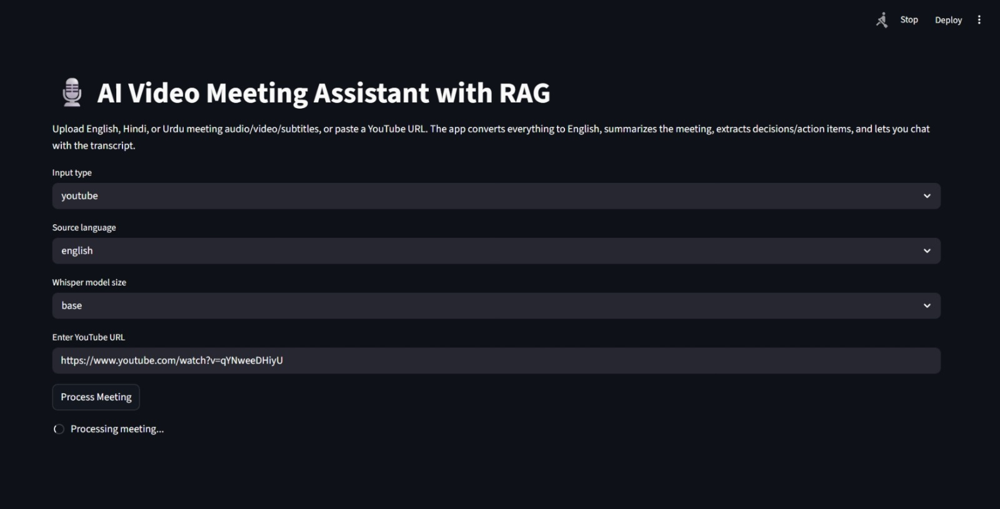
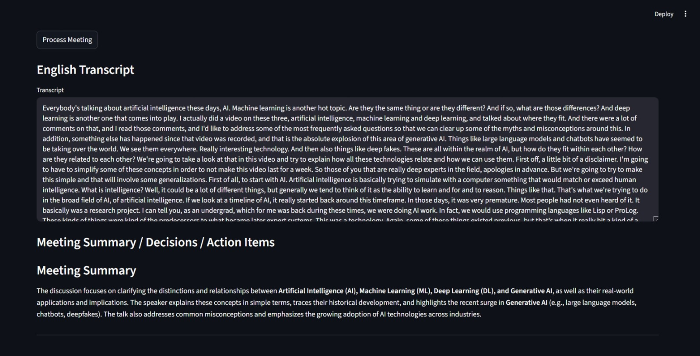
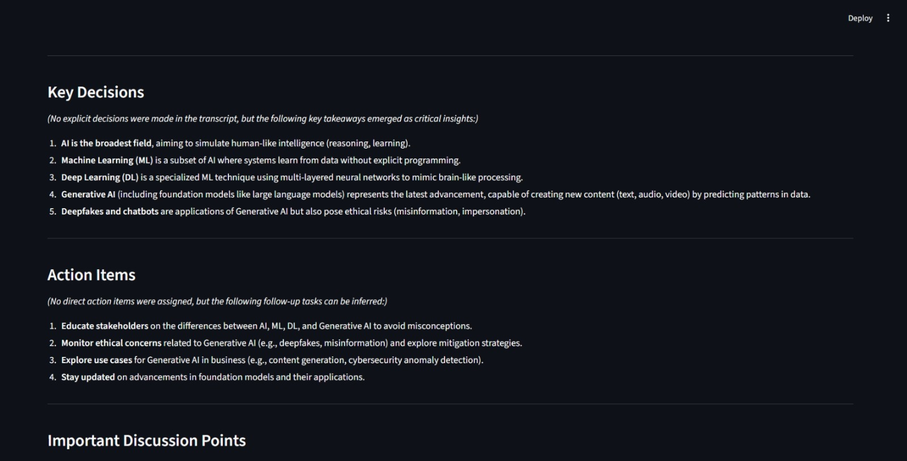
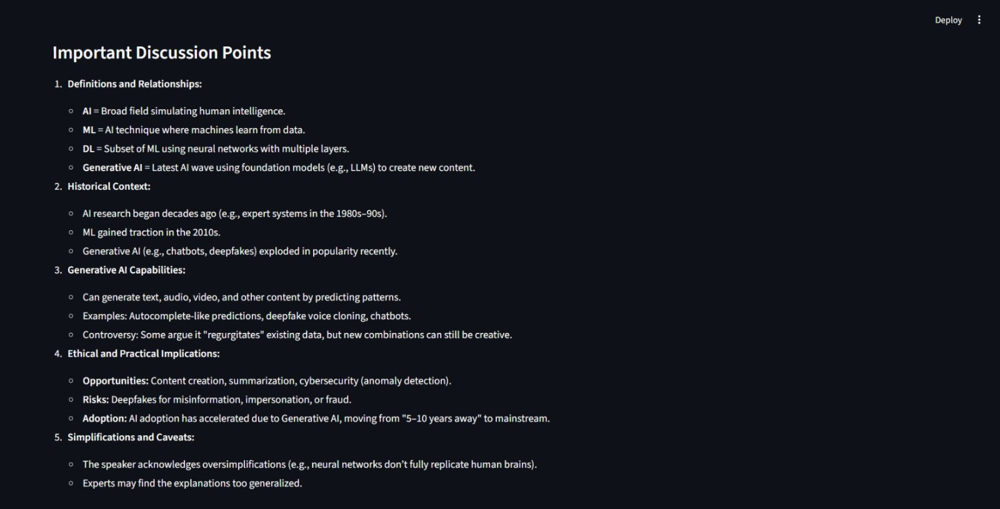
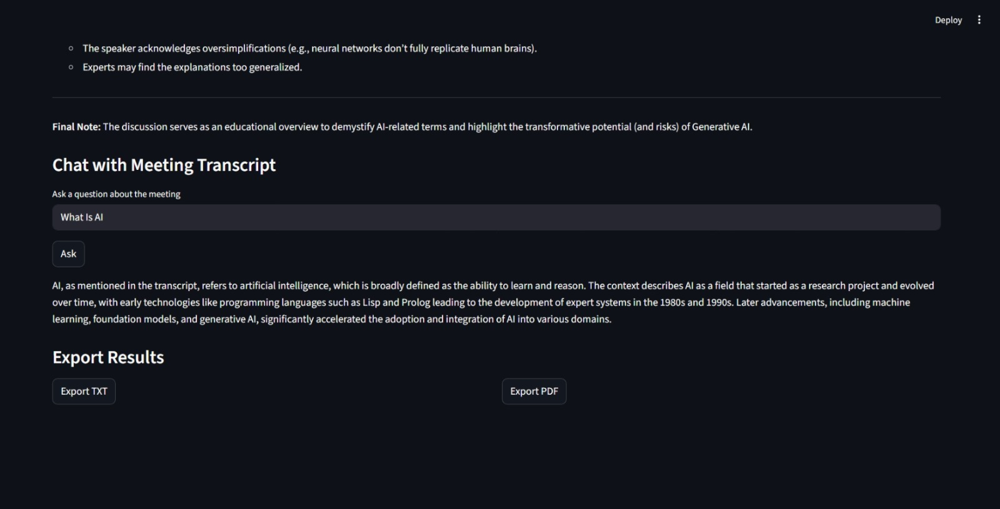
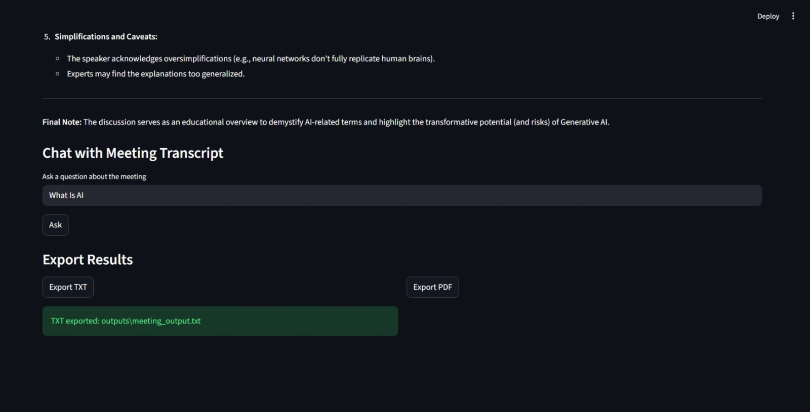

# AI Video Meeting Assistant with RAG

An AI-powered meeting/video assistant built with **Python**, **Streamlit**, **OpenAI Whisper**, **LangChain LCEL**, **Mistral API**, **ChromaDB**, and **HuggingFace embeddings**.

The app accepts a YouTube URL, uploaded video, uploaded audio, or subtitle file. It converts English, Hindi, or Urdu content into an English transcript, summarizes the meeting, extracts key decisions/action items, supports chat with the transcript using RAG, and exports results as TXT or PDF.

---

## Features

- Download audio from YouTube URLs using `yt-dlp`
- Extract audio from uploaded video files using FFmpeg
- Transcribe English audio with local OpenAI Whisper
- Translate Hindi/Urdu speech to English using Whisper `task="translate"`
- Translate Hindi/Urdu subtitle files to English
- Generate meeting summaries, decisions, action items, and discussion points using Mistral API
- Store transcript chunks in ChromaDB
- Chat with the transcript using RAG
- Export transcript and summary as TXT or PDF
- Streamlit web interface

---

## Project Structure

```text
AI Video Assistant with RAG/
│
├── app.py
├── requirements.txt
├── .env
│
├── downloads/
├── uploads/
├── subtitles/
├── outputs/
├── chroma_db/
│
└── utils/
    ├── __init__.py
    ├── config.py
    ├── audio_processor.py
    ├── subtitle_processor.py
    ├── transcriber.py
    ├── translator.py
    ├── meeting_pipeline.py
    ├── summarizer.py
    ├── rag_pipeline.py
    └── exporter.py
```

---

## Tech Stack

| Component | Tool |
|---|---|
| UI | Streamlit |
| YouTube audio download | yt-dlp |
| Audio/video conversion | FFmpeg |
| Speech-to-text | OpenAI Whisper local |
| Hindi/Urdu audio to English | Whisper translation |
| Subtitle translation | deep-translator |
| LLM summarization | Mistral API |
| RAG orchestration | LangChain LCEL |
| Vector database | ChromaDB |
| Embeddings | HuggingFace Sentence Transformers |
| Export | TXT, PDF |

---

## Supported Inputs

| Input Type | Supported Languages | Processing |
|---|---|---|
| YouTube URL | English, Hindi, Urdu | Download audio, transcribe/translate with Whisper |
| Uploaded video | English, Hindi, Urdu | Extract audio, transcribe/translate with Whisper |
| Uploaded audio | English, Hindi, Urdu | Transcribe/translate with Whisper |
| Subtitle file `.srt` | English, Hindi, Urdu | Use directly or translate to English |

---

## Language Pipeline

```text
English audio/video
    → Whisper task="transcribe"
    → English transcript

Hindi audio/video
    → Whisper task="translate"
    → English transcript

Urdu audio/video
    → Whisper task="translate"
    → English transcript

English subtitles
    → Use directly
    → English transcript

Hindi/Urdu subtitles
    → Translate subtitle text to English
    → English transcript
```

The final output is always an **English transcript**, which is then used for summarization, RAG, and export.

---

## Requirements

Use Python 3.10 or newer.

Install dependencies:

```powershell
pip install -r requirements.txt
```

Recommended `requirements.txt`:

```txt
streamlit
yt-dlp
pydub
ffmpeg-python
openai-whisper
torch
torchaudio
deep-translator
langdetect
pysrt
langchain
langchain-core
langchain-community
langchain-mistralai
langchain-huggingface
langchain-chroma
langchain-text-splitters
chromadb
sentence-transformers
huggingface-hub
fpdf2
reportlab
tiktoken
python-dotenv
numpy
pandas
requests
tqdm
watchdog
streamlit-extras
```

---

## FFmpeg Setup

FFmpeg is required for:

- Converting YouTube audio to WAV
- Extracting audio from videos
- Reading audio files for Whisper/pydub

Install FFmpeg on Windows:

```powershell
winget install Gyan.FFmpeg
```


---

## Environment Variables

Create a `.env` file in the project root:

```text
AI Video Assistant with RAG/.env
```

Add your Mistral API key:

```env
MISTRAL_API_KEY=your_mistral_api_key_here
```

Do **not** place `.env` inside the `venv` folder.

Correct:

```text
AI Video Assistant with RAG/.env
```

Wrong:

```text
AI Video Assistant with RAG/venv/.env
```

---

## How to Run

Open VS Code terminal in the project root:

```powershell
cd "\AI Video Assistant with RAG"
```

Activate the virtual environment:

```powershell
Set-ExecutionPolicy -Scope Process -ExecutionPolicy RemoteSigned
.\venv\Scripts\Activate.ps1
```

Run the Streamlit app:

```powershell
streamlit run app.py
```

Open the local URL in your browser:

```text
http://localhost:8501
```

---

## How to Use

### YouTube Video

1. Select `youtube`
2. Select source language: `english`, `hindi`, or `urdu`
3. Select Whisper model size
4. Paste YouTube URL
5. Click **Process Meeting**

### Uploaded Video

1. Select `uploaded_video`
2. Select source language
3. Upload video file
4. Click **Process Meeting**

### Uploaded Audio

1. Select `uploaded_audio`
2. Select source language
3. Upload audio file
4. Click **Process Meeting**

### Uploaded Subtitle

1. Select `uploaded_subtitle`
2. Select subtitle language
3. Upload `.srt` file
4. Click **Process Meeting**

---

## Whisper Model Choices

| Model | Speed | Accuracy | Recommended Use |
|---|---:|---:|---|
| `tiny` | Fastest | Lowest | Quick testing |
| `base` | Fast | Good | Default |
| `small` | Slower | Better | Hindi/Urdu |
| `medium` | Very slow on CPU | Higher | Short high-quality tests |

For normal laptops, start with:

```text
base
```

For Hindi/Urdu, use:

```text
small
```

For very long videos, use:

```text
tiny or base
```

---

## Important Performance Note

This project uses **local OpenAI Whisper**. Local transcription on CPU can be slow.

Example:

```text
10-minute video may take 5–8 minutes on CPU
```

For long videos of one hour or more, this can take a long time.

Recommended strategy:

```text
If subtitles are available:
    use subtitles first

If no subtitles are available:
    use Whisper audio transcription
```

For a fully free local project, this is expected behavior.

---

## RAG Workflow

After transcription:

```text
English transcript
    → split into chunks
    → create embeddings
    → store in ChromaDB
    → retrieve relevant chunks for user question
    → answer using Mistral
```

The user can ask questions such as:

```text
What is AI?
What decisions were made?
What are the action items?
Who is responsible for the next task?
```

---

## Export

The app supports:

- TXT export
- PDF export

Exported files are saved inside:

```text
outputs/
```

Example:

```text
outputs/meeting_output.txt
outputs/meeting_output.pdf
```

---









## Common Errors and Fixes

### `ModuleNotFoundError: No module named 'utils'`

Run files as modules from the project root:

```powershell
python -m utils.audio_processor
```

Do not run:

```powershell
python .\utils\audio_processor.py
```

For the full app, always run:

```powershell
streamlit run app.py
```

---


## Main Commands

```powershell
cd "\AI Video Assistant with RAG"

Set-ExecutionPolicy -Scope Process -ExecutionPolicy RemoteSigned
.\venv\Scripts\Activate.ps1

pip install -r requirements.txt

streamlit run app.py
```

---

## Notes

- This project does not use Sarvam API.
- All speech transcription/translation is done using local OpenAI Whisper.
- Mistral API is used only for summarization and RAG question answering.
- ChromaDB stores transcript embeddings locally.
- FFmpeg must be installed separately.
- Processing large videos locally can be slow without a GPU.

---

## Future Improvements

- Subtitle-first pipeline for YouTube videos
- Automatic language detection
- Progress bar for chunked transcription
- Background job queue for long videos
- Speaker diarization
- Better Unicode PDF export
- Local LLM support with Ollama instead of Mistral API
